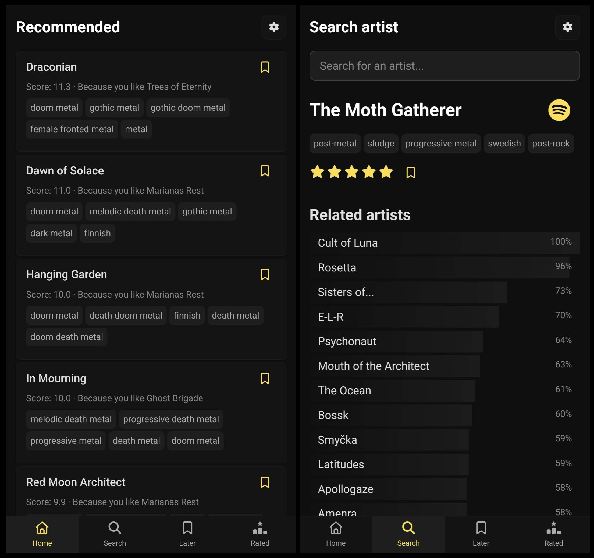
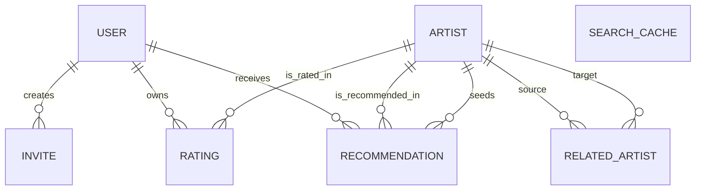

# Bandmap [](https://github.com/Vilsepi/bandmap/actions)

[music.heap.fi](https://music.heap.fi)

Discover new music through similar artists you already like. A hobby project, currently in invite-only beta testing.



Uses [Last.fm](https://www.last.fm) and [MusicBrainz](https://musicbrainz.org/) data, but does not require accounts there.

## Main components

- **Frontend** (`packages/web`): Vite SPA for artist search, ratings, todo list, recommendations as well as sign-up and login process
- **Backend** (`packages/backend`): Two AWS Lambda handlers behind API Gateway — the main API serves auth, cached remote API data, ratings, and recommendations; a dedicated invite API manages user invite creation, validation, and sign-up
- **Authentication** (AWS Cognito): Username/password sign-in via a Cognito user pool and app client. Self-sign-up is disabled; new users are provisioned through invite redemption, and admins can create invite links via the `admin` Cognito group
- **Data** (DynamoDB): Stores app users, invites, cached Last.fm responses, ratings, recommendations, and cached searches
- **Infrastructure** (`packages/infra`): AWS CDK stacks for backend API, DynamoDB tables, Cognito resources, and separate frontend hosting
- **Shared types** (`packages/shared`): TypeScript types and constants shared between frontend and backend

Detailed backend route and DynamoDB schema documentation is in [doc/backend-api-and-data-model.md](doc/backend-api-and-data-model.md).

## DynamoDB schema

The application data model is stored in DynamoDB tables with logical relationships managed in application code.



## Prerequisites

- Node.js >= 24
- A [Last.fm API key](https://www.last.fm/api/account/create) (for deployment)
- AWS account + credentials (for deployment)

## Install dependencies

```sh
npm install
```

## Build

```sh
npm run build
```

## Run unit tests, linter and autoformatter

```sh
npm run test
npm run lint
npm run format
```

## Run the frontend locally

You can directly serve the frontend without building it first:

```sh
npm run serve
```

Then open http://localhost:5173 in your browser and login.

## Run integration tests

Integration tests make live, rate-limited requests to Last.fm and MusicBrainz, so they are not included in `npm run test`.

```sh
LASTFM_API_KEY=your_api_key_here npm run test:integration
```

## Deploy to AWS

To deploy the backend AWS infra resources and the backend Lambda code:

```sh
npm run deploy:backend
```

To deploy the frontend hosting infra:

```sh
npm run deploy:frontend
```

To upload the static frontend assets to the CDN:

```sh
npm run deploy:assets
```
