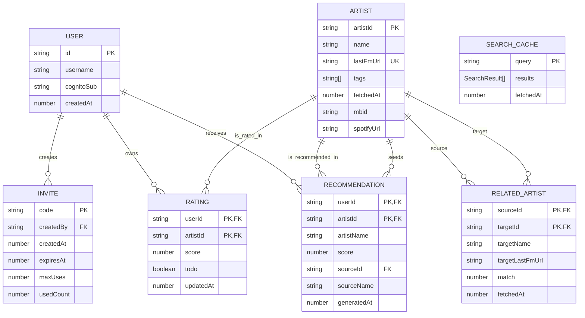

# Backend API and DynamoDB Schema

This document is verified against the current implementation in `packages/infra/src/backend-stack.ts`, `packages/backend/src/handler.ts`, `packages/backend/src/invite-handler.ts`, `packages/backend/src/db.ts`, and the shared API/type definitions.

## Authentication model

- `POST /auth/login` and `POST /auth/refresh` return a `session.sessionToken` and `session.refreshToken`.
- Protected endpoints expect `Authorization: Bearer <sessionToken>`.
- The backend validates the Cognito ID token and resolves the application user from the `custom:app_user_id` claim or the Cognito subject.
- `POST /invites` additionally requires the caller to belong to the Cognito `admin` group.

## DynamoDB tables

| Table | Physical name | PK | SK | Secondary indexes | Notes |
|-------|---------------|----|----|-------------------|-------|
| Users | `bandmap-users` | `id` | - | None | Stores app users. Username uniqueness is enforced in application logic, not by a DynamoDB index. |
| Invites | `bandmap-invites` | `code` | - | None | `expiresAt` is both the expiry timestamp and the DynamoDB TTL attribute. |
| Artists | `bandmap-artists` | `artistId` | - | `lastFmUrl-index` on `lastFmUrl` | Artist records are keyed by Bandmap's internal artist ID, not by MusicBrainz ID. |
| RelatedArtists | `bandmap-related-artists` | `sourceId` | `targetId` | None | Stores directed similarity edges from one artist to another. |
| Ratings | `bandmap-ratings` | `userId` | `artistId` | None | Stores star ratings and/or todo bookmarks per user–artist pair. |
| Recommendations | `bandmap-recommendations` | `userId` | `artistId` | None | Recommendation rows are regenerated per user. |
| Searches | `bandmap-searches` | `query` | - | None | Search queries are cached under the normalized query string. |

## Entity-relationship diagram

The diagram below shows the logical references between DynamoDB items. DynamoDB does not enforce foreign keys, so these relationships are application-level rather than database-enforced constraints.

## Item shapes

### Users

| Attribute | Type | Required | Notes |
|-----------|------|----------|-------|
| `id` | string | Yes | UUID generated by the application. |
| `username` | string | Yes | User-chosen login name. |
| `cognitoSub` | string | Yes | Cognito user subject. |
| `createdAt` | number | Yes | Unix epoch seconds. |

### Invites

| Attribute | Type | Required | Notes |
|-----------|------|----------|-------|
| `code` | string | Yes | Invite code, stored as the table PK. |
| `createdBy` | string | Yes | Application user ID of the admin who created the invite. |
| `createdAt` | number | Yes | Unix epoch seconds. |
| `expiresAt` | number | Yes | Unix epoch seconds; also configured as the table TTL attribute. |
| `maxUses` | number | Yes | Currently defaults to `10`. |
| `usedCount` | number | Yes | Incremented transactionally on redemption. |

Invite behavior enforced in code:

- Invite validity period is 30 days.
- A single `POST /invites` request can create 1 to 50 invites.
- An invite is valid only while `expiresAt > now` and `usedCount < maxUses`.

### Artists

| Attribute | Type | Required | Notes |
|-----------|------|----------|-------|
| `artistId` | string | Yes | Internal artist ID and table PK. |
| `name` | string | Yes | Artist name. |
| `lastFmUrl` | string | Yes | Last.fm canonical artist URL; queryable through `lastFmUrl-index`. |
| `tags` | string[] | Yes | Last.fm tag names. |
| `fetchedAt` | number | Yes | Unix epoch seconds of the last fetch/update. |
| `mbid` | string | No | Optional MusicBrainz ID. |
| `spotifyUrl` | string | No | Optional Spotify artist URL resolved via MusicBrainz. |

Cache behavior enforced in code:

- Artist records are treated as stale after 7 days.
- Artists may be created before full enrichment and later updated with tags, MBID, or Spotify URL.

### RelatedArtists

| Attribute | Type | Required | Notes |
|-----------|------|----------|-------|
| `sourceId` | string | Yes | Source artist ID and table PK. |
| `targetId` | string | Yes | Target artist ID and sort key. |
| `targetName` | string | Yes | Denormalized target artist name. |
| `targetLastFmUrl` | string | Yes | Denormalized target Last.fm URL. |
| `match` | number | Yes | Similarity score from Last.fm. |
| `fetchedAt` | number | Yes | Unix epoch seconds of the last fetch/update. |

Notes:

- Similarity edges are directed: `A -> B` is stored independently from `B -> A`.
- Refresh replaces the full set of rows for a given `sourceId`.

### Ratings

| Attribute | Type | Required | Notes |
|-----------|------|----------|-------|
| `userId` | string | Yes | User ID and table PK. |
| `artistId` | string | Yes | Artist ID and sort key. |
| `score` | number or null | Yes | 1–5 star rating; `null` when the artist has not been scored. |
| `todo` | boolean | Yes | Whether the artist is bookmarked for later listening. Independent of `score`. |
| `updatedAt` | number | Yes | Unix epoch seconds. |

An item must have at least one of `score` (non-null) or `todo = true`; items where both are cleared are deleted automatically.

### Recommendations

| Attribute | Type | Required | Notes |
|-----------|------|----------|-------|
| `userId` | string | Yes | User ID and table PK. |
| `artistId` | string | Yes | Recommended artist ID and sort key. |
| `artistName` | string | Yes | Denormalized recommended artist name. |
| `score` | number | Yes | Computed recommendation score. |
| `sourceId` | string | Yes | Seed artist that contributed the strongest signal. |
| `sourceName` | string | Yes | Denormalized seed artist name. |
| `generatedAt` | number | Yes | Unix epoch seconds. |

### Searches

| Attribute | Type | Required | Notes |
|-----------|------|----------|-------|
| `query` | string | Yes | Normalized search string and table PK. |
| `results` | `SearchResult[]` | Yes | Cached search results. |
| `fetchedAt` | number | Yes | Unix epoch seconds. |

Search cache behavior enforced in code:

- Queries are trimmed and lowercased before storage.
- Search cache entries are treated as stale after 24 hours.

## API endpoints

| Method | Path | Auth | Description |
|--------|------|------|-------------|
| `POST` | `/auth/login` | No | Exchange username and password for the current user profile plus a Cognito-backed session token pair. |
| `POST` | `/auth/refresh` | No | Exchange a refresh token for a fresh session token and the current user profile. |
| `GET` | `/search?q=...` | No | Search Last.fm artists and return cached or freshly fetched results. |
| `POST` | `/invites` | Yes, admin group required | Create one or more invite codes and invite URLs. |
| `GET` | `/invites/validate?code=...` | No | Check whether an invite code exists and whether it is still valid. |
| `POST` | `/invites/redeem` | No | Redeem an invite, create the Cognito user, and persist the Bandmap user record transactionally. |
| `GET` | `/artists/{artistId}` | Yes | Get an artist by internal artist ID, using pull-through cache refresh when stale. |
| `GET` | `/artists/{artistId}/related` | Yes | Get related artists for an internal artist ID, using pull-through cache refresh when stale. |
| `GET` | `/ratings` | Yes | List the caller's ratings and todo items. Optional query parameter: `status=rated` or `status=todo`. |
| `PUT` | `/ratings/{artistId}` | Yes | Create or replace a rating or todo entry for the given internal artist ID. |
| `DELETE` | `/ratings/{artistId}` | Yes | Delete the caller's rating or todo entry for the given internal artist ID. |
| `GET` | `/recommendations` | Yes | Read the caller's currently stored recommendations. |
| `POST` | `/recommendations/generate` | Yes | Regenerate recommendations from the caller's highly rated artists and replace previous rows. |

## Request validation notes

### `POST /invites`

- Request body: `{ "count"?: number }`
- Default count is `1`.
- Valid range is 1 to 50.

### `POST /invites/redeem`

- Request body: `{ "code": string, "username": string, "password": string }`
- Username must match `^[a-zA-Z0-9._-]{3,32}$`.
- Password must be at least 12 characters long.

### `PUT /ratings/{artistId}`

- Request body: `{ "score": number | null, "todo": boolean }`
- `score` must be `null` or a number from 1 to 5.
- `todo` and `score` are independent: setting one does not affect the other.
- If both `score` is `null` and `todo` is `false`, the item is deleted and the endpoint returns `204 No Content`.

## CORS and routing notes

- The HTTP API exposes explicit invite routes and sends all other paths to the main API Lambda through a catch-all route.
- `OPTIONS` requests are handled for CORS.
- Response headers allow `Content-Type` and `Authorization` and the methods `GET`, `PUT`, `POST`, `DELETE`, and `OPTIONS`.
